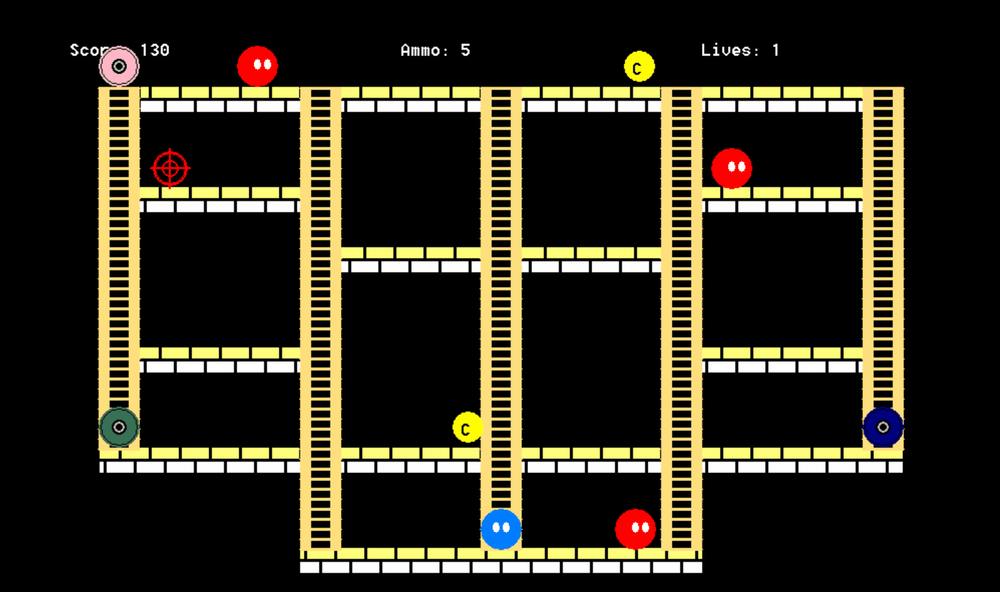

# Piracy Wars
A game inspired by Pacman and other classic arcade games. Its purpose is to educate children on the dangers and illegality of piracy. The user must collect as many pirated CDs as possible without being caught by the criminals who make and sell pirated material. This game was my first major computer science project.

# How to Play
Download, extract, and run the executable [GAME SUMMATIVE.exe](https://github.com/lauradang/Piracy-Wars/blob/master/GAME%20SUMMATIVE.exe) in the repo. Ensure the image [pirated.jpg](https://github.com/lauradang/Piracy-Wars/blob/master/pirated.jpg) is in the same folder as the executable.

**Note:** This game only works on Windows. 

# Built With
Turing

# Author
Laura Dang (2016)
